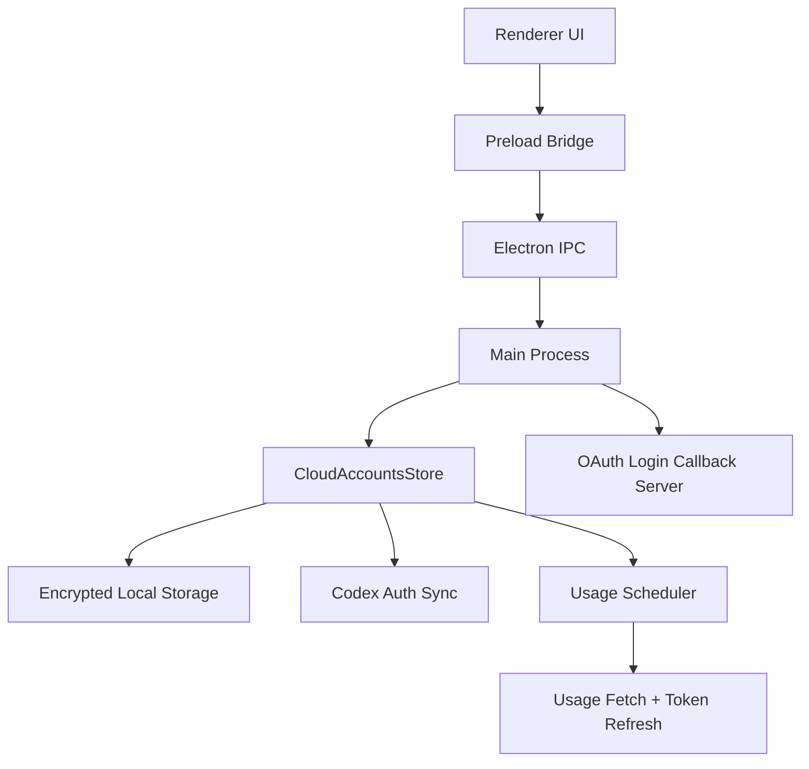
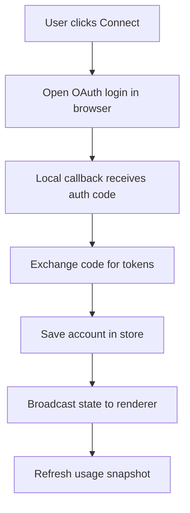
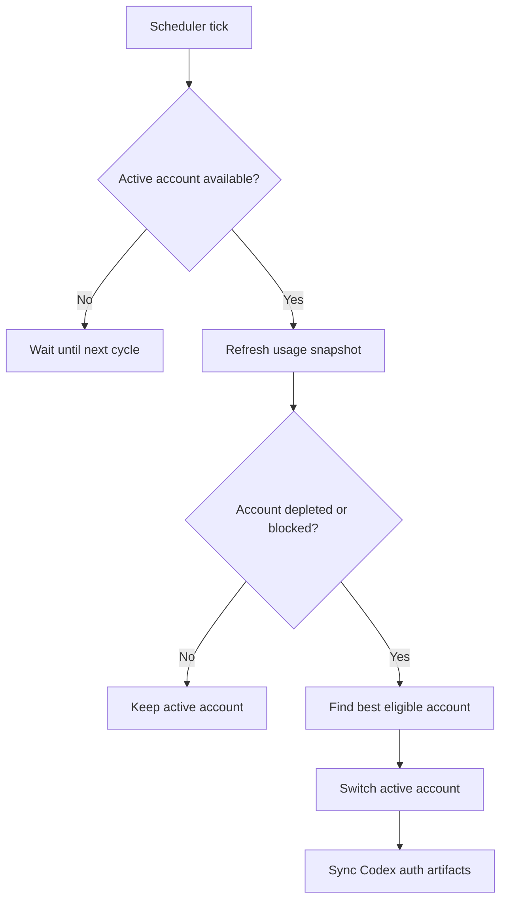
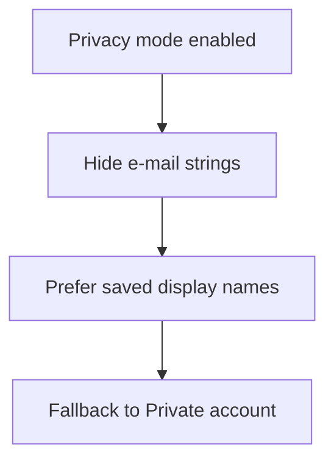

# Cloud Accounts

Cloud Accounts is a desktop control center for managing multiple cloud AI accounts, monitoring Codex usage, rotating active sessions, and keeping login state organized in one place.

It is built for people who regularly switch between accounts and want a cleaner way to:

- connect and store multiple accounts
- monitor 5-hour and weekly usage windows
- rotate the active Codex account automatically
- refresh tokens without constant re-login friction
- hide sensitive e-mails before sharing screenshots

## Highlights

- Multi-account desktop app built with Electron
- ChatGPT login flow with local callback handling
- Automatic usage refresh and account rotation
- Cooldown-aware scheduler for depleted accounts
- Hidden top dock for quick account switching
- Minimal onboarding with platform, language, login, and theme steps
- Accent color customization and light/dark theme control
- Privacy mode to hide account e-mails in the UI
- Usage charts and account health indicators with Fluent Emoji

## What Changed Recently

- Added automatic token refresh and better session recovery
- Added account rotation based on remaining usage
- Added depletion cooldown logic to avoid wasteful rechecks
- Reworked the UI toward a cleaner Ollama-inspired desktop feel
- Replaced the visible sidebar approach with a hidden top dock
- Added a new 4-step onboarding flow
- Added theme accent customization
- Added privacy mode for screenshots and recordings
- Added account state emojis based on health

## Tech Stack

- Electron 37
- React 19
- Vite 7
- TypeScript 5
- Tailwind CSS 4
- Framer Motion
- Recharts
- Radix UI primitives
- Fluent Emoji assets from `@lobehub/fluent-emoji-flat`
- Electron Builder

## Architecture



## Core Flows

### Login and Account Save



### Usage Refresh and Rotation



### Privacy Mode



## Interface Overview

- Hidden top dock for quick account switching
- Main usage hero with current 5-hour window status
- Usage chart with recent token activity
- Right column for identity, rename, and account actions
- Settings modal for theme, language, accent color, and privacy mode

## Project Structure

```text
src/
  main/        Electron main process, storage, auth sync, scheduler
  preload.ts   Safe renderer bridge
  renderer/    React UI, onboarding, settings, charts, styles
  shared/      Shared types used across main and renderer
```

## Local Development

### Requirements

- Node.js 20+
- npm
- Linux, macOS, or Windows desktop environment

### Install

```bash
npm install
```

### Start development mode

```bash
npm start
```

This runs:

- Vite dev server
- Electron TypeScript watcher
- Electron desktop app

### Typecheck

```bash
npm run typecheck
```

### Production build

```bash
npm run build
```

### Desktop packages

```bash
npm run dist
```

Platform-specific:

```bash
npm run dist:linux
npm run dist:win
npm run dist:mac
```

## Packaging

The project uses `electron-builder` and outputs artifacts to `release/`.

Configured targets:

- Linux: `deb`, `AppImage`
- Windows: `nsis`
- macOS: `dmg`

## Security Notes

- Account secrets are stored locally through Electron secure storage when available
- Active provider artifacts are synchronized only when needed
- Depleted accounts are not pinged continuously; they wait for the next reset window
- Privacy mode can suppress e-mail exposure in the interface

## Current Product Direction

Cloud Accounts is moving toward:

- cleaner desktop-first UX
- faster multi-account switching
- less manual re-login friction
- clearer live usage visibility
- better privacy when sharing the app on streams, screenshots, or demos

## License

Define the project license before public release if this repository is going to stay open on GitHub.
